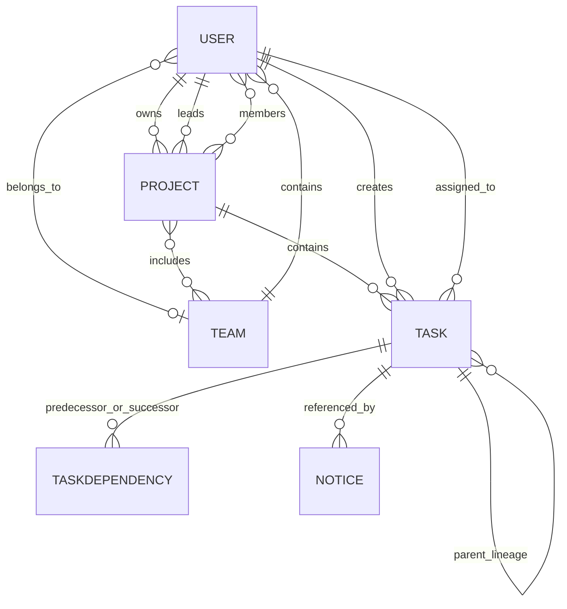

# Task Management System

This repository contains a full-stack task-management application for project-based work coordination, team organization, role-aware assignment, workload enforcement, and task lifecycle tracking. The implementation is a working Node.js + Express backend and a React + Vite frontend that are designed to operate together through a single API layer.

The codebase is the source of truth for behavior. Where an earlier design note or UI label differs from runtime behavior, the implemented controllers, models, utilities, and tests take precedence.

## Project overview

The system is designed for a structured organization with three primary layers:

- Users and approval state
- Teams and organizational membership
- Projects and task execution

At a high level, the application allows admins to manage access and configuration, teams to group staff, projects to define work scopes, and project leaders to distribute tasks while enforcing assignment constraints.

Key functional areas implemented in this repo:

- User authentication and approval flow
- Google sign-in flow via Firebase client integration
- Admin-only administration screens for users and teams
- Team creation and membership updates
- Project creation and project-member validation
- Task creation, reassignment, completion, and deletion
- Subtask and activity tracking
- Task dependencies and scheduling analysis
- Workload and priority-based assignment rules
- Project filtering, dashboard summaries, and trash/restore behavior

## Technology stack

### Frontend

- React
- Vite
- Redux Toolkit
- RTK Query
- Tailwind CSS
- React Router DOM
- Firebase Authentication for Google login
- Sonner for notifications

### Backend

- Node.js
- Express
- MongoDB with Mongoose
- JWT-based authentication
- bcryptjs for password hashing
- Cookie-based session handling

### Infrastructure and tooling

- Docker Compose
- Dockerfiles for frontend and backend
- Node test runner for server-side validation tests

## Repository structure

```text
.
├── README.md
├── docker-compose.yml
├── client/
│   ├── Dockerfile
│   ├── index.html
│   ├── nginx.conf
│   ├── package.json
│   ├── postcss.config.js
│   ├── tailwind.config.js
│   ├── vite.config.js
│   └── src/
│       ├── App.jsx
│       ├── assets/
│       ├── components/
│       ├── pages/
│       ├── redux/
│       └── utils/
├── server/
│   ├── Dockerfile
│   ├── index.js
│   ├── package.json
│   ├── controllers/
│   ├── middlewares/
│   ├── models/
│   ├── routes/
│   ├── scripts/
│   ├── tests/
│   └── utils/
└── .gitignore
```

## Runtime architecture

The app follows a layered architecture:

1. Frontend UI layer
   - route-based pages in `client/src/pages`
   - reusable components in `client/src/components`
   - Redux slices and RTK Query endpoints in `client/src/redux`

2. API layer
   - backend Express app mounted under `/api`
   - routes are grouped in `server/routes`

3. Controller layer
   - request handling and validation logic in `server/controllers`

4. Domain and utility layer
   - schemas and validation in `server/models` and `server/utils`

5. Security layer
   - JWT + middleware checks in `server/middlewares/authMiddlewave.js`

## Core domain model

### User

The user model is defined in `server/models/user.js`. It stores the user account and approval state.

Important fields include:

- `name`
- `email`
- `password`
- `title`
- `role`
- `team`
- `technicalRoles`
- `isAdmin`
- `isActive`
- `status`
- `googleAuth`

The schema includes password hashing via `bcryptjs` and normalizes names and emails before validation.

### Team

A team is an organizational container with:

- `name`
- `leader`
- `members`

The leader is required to be an approved, active user, and the team membership is synchronized in the user records.

### Project

The project model in `server/models/project.js` stores:

- `name`
- `description`
- `owner`
- `projectLeader`
- `teams`
- `members`
- `status`
- `plannedStart`
- `plannedDeadline`
- `actualStart`
- `actualCompletion`

A project may include multiple teams while still retaining a single project leader and an explicit project member list.

### Task

The task model in `server/models/task.js` is the core delivery artifact. It supports:

- assignee and creator references
- priority and stage
- planned and actual dates
- project linking
- subtasks and activity history
- soft delete via `isTrashed`
- optional dependency references and duplicate lineage

## Role system and permissions

The app separates three concepts:

- `isAdmin`: system-level administrative authority
- `role`: organizational role label
- `projectLeader`: project-specific leadership assignment

The role definitions are centralized in `server/utils/roles.js`.

### Role values

The implemented role model is based on organizational hierarchy values such as:

- `ADMIN`
- `TEAM_LEADER`
- `ASSOCIATE`
- `JUNIOR`
- `INTERN`

The app also enforces assignment-related rules in helper functions such as:

- `normalizeRole`
- `canDelegateTo`
- `validateAssignmentTarget`

These utilities decide whether a user can delegate or receive a task based on role and team/project membership.

### Important rule: admin assignment is blocked at the server layer

The application explicitly prevents admin users from being assigned to tasks. This is implemented in:

- `server/utils/roles.js`
- `server/utils/taskAccess.js`
- relevant controller checks in task creation/delegation flows

This is a critical business rule: frontend filtering helps UX, but server-side enforcement is the actual authority.

## Authentication and login flow

Authentication is handled by the backend and uses JWT plus cookie-based storage.

### Routes

Routes for user actions are mounted in `server/routes/index.js` and `server/routes/userRoutes.js`.

Primary auth endpoints include:

- `POST /api/user/register`
- `POST /api/user/create` (admin-only account creation)
- `POST /api/user/login`
- `POST /api/user/logout`
- `POST /api/user/google`
- `PUT /api/user/profile`
- `PUT /api/user/change-password`

### Login behavior

The login flow verifies:

- email exists
- password matches the stored hash
- user is active and approved
- any admin or access rules are respected

On success, the backend creates a JWT and sends it in a cookie. The frontend stores the user payload in Redux local storage via `authSlice`.

### Google sign-in

The frontend uses Firebase Google provider in `client/src/utils/firebase.js`.

The Google sign-in sequence:

1. User clicks Google sign-in in the login page.
2. Firebase returns a Google user profile.
3. The frontend sends `{ name, email, title, role, googleAuth }` to `/api/user/google`.
4. The server validates the input, creates a pending account if needed, or logs in an existing approved user.
5. Pending Google-created users wait for admin approval.

## Authorization model

Authorization is enforced primarily in backend middleware, not only in the UI.

Relevant middleware:

- `protectRoute`
- `isAdminRoute`
- task and project access checks

These guards are implemented in `server/middlewares/authMiddlewave.js`.

### Admin-only paths

The following actions are restricted to admin users:

- create/delete teams
- approve or reject user accounts
- delete users
- create projects
- delete projects
- create duplicate tasks
- multiple project-level admin workflows

### Non-admin access rules

Project/task access depends on:

- project membership
- project leader status
- team membership
- assignee relationship
- task visibility rules

The UI route guards in `client/src/App.jsx` provide navigation restrictions but should not be understood as the security boundary. The server is authoritative.

## Team management

Team operations are handled from `server/controllers/teamController.js`.

### Team creation

A team can be created only by an admin. The process requires:

- a valid team name
- a valid team leader
- active and approved user status
- the leader is not already assigned to another team

After creation:

- the leader is added to the team membership list
- the user record `team` is updated
- the leader remains the single team leader

### Team member updates

The system supports:

- adding/removing team members
- moving a user from one team to another
- preventing invalid `ADMIN` role assignments to team membership

The implementation explicitly excludes admin users from normal team assignment flows.

## Project management

Project operations are coordinated in `server/controllers/projectController.js` and `server/models/project.js`.

### Project lifecycle

A project includes:

- owner
- project leader
- participating teams
- explicit project members
- lifecycle status such as planning/active/completed/archived

### Project member validation

Project participants are validated before creation/update. The system checks:

- owner is approved and active
- project leader is approved and active
- project leader is included in project members
- teams exist and are valid
- members are valid and approved
- explicit project members belong to participating teams or are the owner

### Project visibility

Project visibility is derived from a combination of:

- admin access
- owner access
- project leader relationship
- explicit project membership
- team membership

This visibility is not automatically equivalent to task-level visibility. Task access is still enforced independently.

## Task system

The task domain is implemented in `server/models/task.js`, `server/controllers/taskController.js`, and the utility modules under `server/utils`.

### Task fields and values

Task properties include:

- `title`
- `description`
- `keywords`
- `requiredTechnicalRoles`
- `requiredLevel`
- `exactLevelOnly`
- `roleMatchMode`
- `assignee`
- `createdBy`
- `project`
- `parentTask`
- `priority`
- `stage`
- `date`
- `plannedStartDate`
- `dueDate`
- `estimatedDuration`
- `subTasks`
- `activities`
- `isTrashed`

### Task stages

The app tracks task progression through stages such as:

- `todo`
- `in progress`
- `completed`

Stage transitions are validated by backend logic so that actions like completion cannot bypass the expected lifecycle rules.

### Task creation and delegation

The system supports:

- standalone task creation
- project-linked task creation
- task reassignment
- task duplication
- task deletion and trash/restore flows

Delegation logic considers:

- role hierarchy
- project membership
- task requirements
- workload limits
- admin restrictions

## Skills, technical roles, and task matching

Task eligibility is richer than a simple assignee check. The app has task access utilities in `server/utils/taskAccess.js`.

This system evaluates:

- required technical roles for the task
- user technical role match
- skill compatibility
- project-member eligibility
- target role validity
- exact-level or range-based level constraints

### Role match mode

The task model supports matching logic such as:

- `ANY`
- `ALL`
- exact-level constraints

This is intended to support role-sensitive assignment scenarios where a task requires a broader or narrower skill fit.

## Workload system

Workload logic is implemented in `server/utils/workload.js` and is central to assignment validation.

### Workload calculation

The app calculates project workload with a rolling time window. The current logic includes:

- project-specific tasks only
- assignee-specific accumulation
- weighted priority points
- hard-count limits for HIGH and MEDIUM work
- a maximum total workload threshold of 20 points per member

### Priority weight table

| Priority | Weight | Hard count rule           |
| -------- | -----: | ------------------------- |
| HIGH     |      5 | max 1 active-window task  |
| MEDIUM   |      3 | max 3 active-window tasks |
| NORMAL   |      2 | no hard count cap         |
| LOW      |      1 | no hard count cap         |

The app rejects new assignment requests if projected workload exceeds the allowed limit or if hard count caps are exceeded.

### Workload status

The dashboard and assignment views use workload thresholds for status labels:

- `AVAILABLE`
- `NEAR_LIMIT`
- `FULL`
- `OVERLOADED`

These states are derived from the ratio of current workload to the project threshold.

## Scheduling and dependencies

Task dependency implementation is in `server/utils/taskDependencies.js` and `server/models/taskDependency.js`.

### Dependency rules

The app models task sequencing with finish-to-start relationships. A task can depend on earlier tasks, and the system validates whether dependencies are acceptable before allowing state transitions or completions.

### Scheduling analysis

The frontend includes a scheduling analysis page for project planning and work sequence review. This carries the project and task dependency information into a visual schedule-oriented page.

## Notification system

The notification model is in `server/models/notification.js` and the API is exposed through user routes.

Users can:

- fetch notifications
- mark notifications as read
- receive task assignment and task-related notices

Notifications are a core part of the assignment workflow and keep users informed when tasks are assigned or updated.

## Data validation

Validation is not just frontend-only. The backend includes centralized validation utilities in `server/utils/validation.js`.

These validators cover things like:

- name validation
- email normalization and checking
- task keyword validation
- assignment target validation

This matters because the backend is the actual enforcement layer; UI checks are only a convenience measure.

## API structure

The backend is mounted on `/api` with route grouping under `server/routes/index.js`.

### Main route prefixes

- `/api/user`
- `/api/task`
- `/api/team`
- `/api/project`

### Notable route categories

#### User

- register and login
- approval workflows
- profile editing
- password change
- notification retrieval
- Google auth handling

#### Task

- create/update/delete/trash/restore
- task detail access
- dependency and subtasks management
- activity posting
- assignment/delegation actions

#### Team

- team creation
- member adding/removing
- team movement actions
- delete team

#### Project

- create project
- fetch project details
- workload analysis
- project member validation
- scheduling overview

## Frontend architecture

The client is organized around reusable UI components and route-based pages.

### Main pages

- Login
- Dashboard
- Tasks
- ProjectDetails
- Projects
- Teams
- Users
- SchedulingAnalysis
- TaskDetails
- Trash

### Redux state

State is split into:

- `auth` slice for user profile and UI sidebar state
- RTK Query API slice for network requests

The app stores the user object in local storage after successful login, which is then loaded during page initialization.

## Docker and deployment

The repo includes Docker configuration for both services.

### Docker Compose

`docker-compose.yml` defines:

- frontend service on port `3000` mapped to Nginx port `80`
- backend service on port `8800`
- backend loads environment variables from `./server/.env`

### Dockerfiles

- `client/Dockerfile` builds a production frontend bundle and serves it with nginx
- `server/Dockerfile` installs Node dependencies and runs the backend with `npm start`

## Environment variables

A production or local `.env` file should exist in the server directory. The project expects values such as:

```env
PORT=8800
MONGO_URI=mongodb://localhost:27017/taskmanager
JWT_SECRET=your_jwt_secret
CLIENT_URL=http://localhost:3000
```

The frontend reads the API base URL from `VITE_APP_BASE_URL` or falls back to `/api`.

The Firebase client configuration also reads values from Vite env variables such as:

- `VITE_APP_FIREBASE_API_KEY`
- `VITE_API_URL`

No `.env.example` file is included in the repository at the moment, so environment setup is currently project-specific and should be created locally before running the app.

## Local development setup

### 1. Install backend dependencies

```bash
cd server
npm install
```

### 2. Install frontend dependencies

```bash
cd ../client
npm install
```

### 3. Configure environment variables

Create a local `server/.env` file with the required MongoDB and JWT configuration.

### 4. Start backend

```bash
cd server
npm start
```

### 5. Start frontend

```bash
cd client
npm run dev
```

The frontend commonly targets the Vite development server on port 5173, while the backend listens on its configured port (for example 8800).

## Docker workflow

To run the project in containers:

```bash
docker compose up --build
```

This starts both services with the configured Dockerfiles and port mappings.

## Testing

The backend includes a testing suite under `server/tests`.

Examples of test areas include:

- task status flow
- task access
- project access
- scheduling rules
- team membership
- workload validation
- subtasks
- task assignment dates
- dependency validation
- CPM logic

A typical backend verification command is:

```bash
cd server
node --test tests/*.test.mjs
```

These tests are important for preventing regression in assignment logic, authorization boundaries, workload checks, and task state transitions.

## Security and validation notes

This project is built around stricter backend validation and business rules. The main safety principle is:

- frontend validation is useful for UX
- server-side validation is authoritative

The codebase explicitly guards against:

- assignment of admin users to tasks
- invalid role values
- invalid names/emails
- missing project member constraints
- invalid task keyword lists
- invalid task assignments outside team/project rules

## Known limitations and design notes

This repository is a working project rather than a production-grade SaaS platform, and some limitations are visible in the code:

- some validation paths are still inconsistent across older endpoints and may rely on legacy assumptions
- team/project/member visibility logic is nuanced and sometimes dependent on multiple sources of truth
- some write operations are not wrapped in MongoDB transactions
- the project includes both frontend route guards and server-side checks, and the UI should not be treated as the sole enforcement mechanism
- the repo currently does not include a full example `.env` file in source control

These are not blockers for the project’s core functionality, but they are important to understand when extending the system.

## Business rules summary

The implemented app enforces several high-value rules:

- Admin accounts are not normal assignment targets.
- Only approved, active users can participate in project and team workflows.
- Project tasks require explicit project membership.
- Workload caps are calculated and enforced on the backend.
- Team leaders are distinct from project leaders.
- Task completion and reassignment follow state-based validation rules.
- Dependency operations are restricted to valid task relationships.
- Soft-deleted tasks are treated differently from deleted tasks.

## Future enhancements

The current codebase leaves room for improvements such as:

- a clearer central permission matrix
- transaction wrapping for multi-document writes
- stricter environment example files and deployment config
- richer audit logs and activity classification
- advanced dashboard analytics and export features
- role-based API permissions cleanup and documentation generation

## Conclusion

This repository is a full-stack collaborative task-management system built around real organizational constraints, not just a simple Kanban board. It combines a React frontend, Express/Mongoose backend, authentication, team and project logic, assignment restrictions, workload enforcement, dependencies, and dashboards into one application.

The implementation is especially strong in the areas of:

- role-aware assignment rules
- server-side validation and access checks
- workload enforcement
- task lifecycle control
- team/project hierarchy modeling

For this project, the code under `server` and `client/src` is the authoritative reference, and the backend middleware and utilities should be treated as the final source of policy decisions.

- **Normal/low count:** there is no independent count limit, only the weighted cap.
- **Duplicate:** creates a fresh assignment date but does not validate workload before creation. This is an implementation gap.

The Task activity subdocument currently declares its date default as a `Date` object rather than a default-producing function. Since workload uses assignment-activity dates before `Task.date`, an assignment activity created without an explicit date can receive a stale process-start default. That can misclassify assignment age for workload-window calculations. The controller does explicitly set `Task.date` to server time, but the workload helper prefers the activity date when present. This is a known issue, not an intended rule.

## 9. Workload Monitoring

`GET /api/project/:id/workload` returns a workload summary to the project leader or Admin. It contains allocation period, capacity, project, member summaries, and, when a `memberId` query is supplied, that member's summary. Supplying `priority` with a member previews whether one additional task would be accepted. Member summaries include identity, team, per-priority task counts, workload points, remaining points, percentage, status, and overdue task count.

The project details UI requests workload for the current project and displays workload information for authorized views; the task form displays a workload preview after a project member and priority are selected. The API endpoint `GET /api/project/workload-overview` aggregates project and member workload information for Admins, including counts of members near limit/at capacity and members with overdue tasks. The current frontend does not provide a dedicated Admin-wide workload-overview page/query, so that endpoint is available to API clients but is not a standalone dashboard screen.

## 10. Task Assignment Validation

Task creation is authenticated and the server applies checks in the controller. Frontend visibility and workload preview improve the workflow but do not authorize a request.

Project task creation path:

1. **Authentication:** `protectRoute` requires a valid JWT cookie.
2. **Creator and target:** both users must exist.
3. **Schedule fields:** planned start and due date cannot be before the current server-local day; planned start cannot be after due date; duration must be positive when supplied.
4. **Project lookup:** project must exist.
5. **Creator authority:** an Admin may create the task for the project's Project Leader; otherwise the creator must be the Project Leader and pass project delegation rules.
6. **Target membership:** target must be an explicit project member.
7. **Priority count limit:** HIGH count cannot exceed one and MEDIUM cannot exceed three in the rolling window.
8. **Workload capacity:** projected weighted points cannot exceed 20.
9. **Persistence and notification:** task is created with server assignment time, followed by a notice for the assignee.

Standalone task creation uses `canDelegateTo`: the source and target must meet the role hierarchy and, for non-admin users, belong to the same non-null team. An Admin delegation target must be a Team Leader with a team.

Task delegation also requires task access, then applies the project or standalone delegation rules. Project delegation validates workload against the target member before changing the assignee. The task update endpoint validates schedule fields and stage transitions but does not permit a client to overwrite `Task.date`. Duplicate and general priority edits do not run the workload assignment validator; this is a known gap.

Backend validation and authorization are the enforcement layer. A caller can alter browser requests, so disabled controls or client-side preview must never be treated as a security boundary.

## 11. Assignment Date and Calendar Rules

### Assignment date

The Task form displays **Assignment Date** populated with the current local calendar date and disables the field. On create, the frontend omits this value from the request. The backend sets `Task.date` to the current server timestamp; client-supplied historical or future `date` values are ignored. Task edits do not change the original assignment date. Reassignment and task duplication establish a new server timestamp.

`Task.date` is a timestamp, not a due date. The date shown in a browser can be rendered in local time; the database stores a server-generated date/time instant.

### Planned dates and past-date restriction

The task creation/edit UI sets the native date input `min` to the browser's local today for planned start and due date. Project creation/edit date inputs also set that minimum. The backend independently rejects past **task** planned-start and due dates using the server's local calendar day, and checks that planned start is on or before due date. The Mongoose Task validation also rejects reversed planned start/due dates.

Project planned start/deadline have a browser input minimum but no equivalent server-side past-date validation in the project controller. The assignment timestamp is server-generated and does not use a user-editable calendar field. No past-date restriction is applied to actual start or actual completion timestamps.

Date-only strings such as `YYYY-MM-DD` are parsed by JavaScript as UTC before the validator extracts local date components. In a non-UTC server timezone, this can shift the interpreted calendar day; configure and test server timezone behavior for the deployment environment.

## 12. Stages, Activities, and Subtasks

### Task stages

The schema values are `todo`, `in progress`, and `completed` (UI labels are commonly uppercase). The transition utility permits:

```text
todo -> in progress -> completed
```

It rejects direct `todo -> completed`, reopening a completed task, and starting/completing when any predecessor is not completed. Entering `in progress` records `actualStartDate` if missing; entering `completed` records `actualCompletionDate` if missing. For project tasks, the controller sets project `actualStart` on first task start and sets project `actualCompletion` when every non-trashed project task is complete.

This is not enforced for every possible write path: task creation accepts a supplied enum stage and task duplication copies the existing stage. The activity endpoint's `assigned` action directly resets stage to `todo`. These are current implementation details; use the status transition actions for normal workflow.

### Activities and timeline

Activities are embedded in the Task document; there is no separate Activity collection. Every activity can contain `type`, text (`activity`), a `date`, and an optional `by` User reference.

Implemented activity types and behavior:

| Type          | Behavior                                                                                                                                      |
| ------------- | --------------------------------------------------------------------------------------------------------------------------------------------- |
| `assigned`    | Assignment/delegation record. The activity endpoint's assigned action resets stage to `todo`; create/delegate also create assignment history. |
| `started`     | Moves task to `in progress` through the transition validator.                                                                                 |
| `in progress` | Moves task to `in progress` through the transition validator.                                                                                 |
| `bug`         | Also moves task to `in progress` through the transition validator; it is not a separate task stage.                                           |
| `completed`   | Requests transition to completed and checks predecessors.                                                                                     |
| `commented`   | Records ordinary activity text without changing task stage.                                                                                   |

The UI offers activity/timeline interaction to users who can access the task. Activity entries cannot be edited or deleted through a dedicated API. Status event activities are added by transition handling; assignment and delegation append assigned activities; ordinary text becomes `commented`. No notice is generated for every activity/status change.

### Subtasks

Subtasks are embedded checklist items with a required trimmed title (maximum 200 characters) and `completed` boolean (default `false`). Users with access to the parent task can add a subtask and toggle its completion. The task details page displays the checklist and completion state. There is no subtask delete endpoint, assignee, date, priority, dependency, or independent lifecycle. Completing a subtask does not change its parent task stage or project progress.

## 13. Task Assets

The user-facing Add Asset feature has been removed: task forms no longer include a file picker, and task cards, lists, and details no longer show asset counts or a gallery. There is no asset upload endpoint in the API.

For backward compatibility, the Task schema still has a legacy `assets: [String]` field and the Admin duplicate controller copies that field. Normal task creation/editing does not accept or update assets. Existing database values and static sample data may remain, but users cannot add or manage assets through the current UI. Cloudinary and Multer packages remain in the server dependency list but are not wired to a current asset route/controller.

## 14. Notifications

Notifications are `Notice` documents. The schema field named `team` is actually an array of recipient User IDs; `isRead` is an array of User IDs that have read that notice. The notice can reference a task, has text and a `notiType` (`alert` or `message`), and has Mongoose timestamps. Current creation paths use the default `alert` type.

Current task notices are generated for task creation/assignment, delegation to a new assignee, and task duplication. The notice is addressed to the assignee. Status changes and comments do not generate a notice by default.

`GET /api/user/notifications` returns unread notices addressed to the authenticated user. The notification panel displays up to five items at a time, can open a notice, mark one as read, or mark all as read. Read state is tracked per user. There is no separate notification router; notification operations are under `/api/user`.

## 15. Authentication and Registration

### Email/password flow

1. The user submits email and password to `POST /api/user/login`.
2. The server looks up the email and checks pending/rejected/inactive state for non-admin accounts.
3. The server compares the submitted password with the bcrypt hash.
4. On success, the server signs a JWT containing the user ID with a one-day expiry and places it in the `token` HTTP-only cookie.
5. RTK Query sends requests with credentials; `protectRoute` verifies the cookie and loads the User's ID, role, team, and admin flag.
6. Logout clears the cookie. The frontend also stores profile data in local storage; the JWT itself is not stored there.

Passwords are hashed by the User Mongoose pre-save hook with bcryptjs using 10 salt rounds.

### Registration and approval lifecycle

```text
Public registration -> pending + inactive -> Admin review
                                   |                  |
                                rejected          approved + active
                                                       |
                                                      login
```

- **Normal registration:** requires name, email, password, role, and title. Public registration rejects `ADMIN`; new users are pending and inactive.
- **Admin-created user:** the same registration controller is mounted behind Admin middleware; the new account is approved and active immediately.
- **Approval/rejection:** Admins can set a user to `approved`, `rejected`, or `pending`. Approval activates the account; other statuses deactivate it.
- **Activation/deactivation:** Admins can change account activation. A Team Leader may change activation for eligible users in the same team, but cannot change their own state or another Team Leader's state.
- **Reactivation:** setting `isActive` true for a pending user also changes its status to approved. Reactivating rejected users through the activation route does not itself change the rejected status; approval endpoint is the explicit status workflow.
- **Google registration:** Firebase popup sign-in occurs in the frontend. The client posts identity fields to `/api/user/google`. A new Google account is created pending/inactive; an existing approved, active account receives a JWT. Pending/rejected/inactive accounts are rejected.

The Google endpoint does not verify a Firebase ID token server-side; it trusts posted identity fields. This is a security limitation, not equivalent to a verified OAuth backend flow.

### Password changes and recovery

Authenticated users can submit a new password to `PUT /api/user/change-password`; the endpoint does not request/verify the current password. The login page displays “Forget Password?” but there is no password-reset workflow/API.

## 16. Authorization and Security

- Protected API endpoints use `protectRoute`, which verifies the JWT from the HTTP-only `token` cookie and attaches a limited identity record to `req.user`.
- Admin-only routes use `isAdminRoute`, which checks `req.user.isAdmin`.
- Task access permits Admin, current assignee, or the Project Leader of the task's project. Task creator and project owner do not receive task access solely through those relationships.
- Task deletion is narrower: Admin or the Project Leader of the task's project. Standalone-task deletion is therefore Admin-only.
- Project visibility, management, membership, and task assignment are checked in project utilities/controllers.
- Team operations are Admin-only except read access and the controller-authorized activation route.
- The frontend also checks local user state for routes and controls, but API checks are authoritative.
- Cookies are HTTP-only, expire after one day, and set `secure` unless `NODE_ENV` is exactly `development`. `SameSite` is `none` only in production and otherwise `lax`. Express CORS is configured for a fixed list of local origins with credentials enabled; deployment origins must be configured in code.

Known security gaps include the unverified Google identity payload, password changes without current-password confirmation, and the middleware's failure to re-check `status`/`isActive` on every request. Login blocks inactive users, but an already-issued valid JWT is not immediately revoked when an account is deactivated. The startup default-admin helper also resets the password for an existing bootstrap account; see [Known Issues](#28-current-limitations-and-known-issues).

## 17. Dashboard and Task Views

### Dashboard

The Admin and non-admin users use the same dashboard UI with role-dependent API data. The dashboard displays total tasks, counts by stage, priority chart data, the latest ten tasks, and an Admin-only approved/active user summary. Admin task counts cover all non-trashed tasks. Non-admin counts cover tasks assigned to the user plus tasks belonging to projects they lead. It does not provide a dedicated workload-overview screen.

The dashboard also initializes an n8n chat widget using a webhook URL hard-coded in the client.

### Task list

The Tasks page provides Board View and List View tabs. Routes can filter by the implemented task stages (`todo`, `in progress`, `completed`). The task API also accepts `isTrashed` to switch between active and trashed tasks. There is no functional global text search or priority filter in the task list; the navbar search field is a visual control only.

### Task detail

Task Details displays priority, stage, schedule values, assignee, subtasks, task dependencies, and activity/timeline. Users with task access can use the available status actions, add comments/activities, manage dependencies through the current UI, and add/toggle subtasks. There is no user-facing asset section.

### Projects and teams

Projects lists visible projects; Admins can create them. Project Details provides project metadata, progress, team/member editing (subject to authority), project tasks, workload data when authorized, dependency order, and navigation to Scheduling Analysis. Teams provides organizational views and, for Admins, team creation, search, membership movement, account status controls, and guarded team deletion. The team search input is functional; the navbar's general search is not.

## 18. Trash, Restore, and Deletion

Moving a task to trash sets `isTrashed: true`; ordinary task lists, project progress, workload queries, CPM, and dependency-order task queries exclude trashed tasks where implemented. Task dependencies are not removed just because a task is trashed.

The Trash page supports restoring or permanently deleting individual items. Admins also have Restore All and Delete All controls.

- **Move to trash:** Admin or Project Leader of the task's project. Standalone task trashing is Admin-only.
- **Restore one:** task-access rules (Admin, assignee, or Project Leader) apply.
- **Restore all:** Admin-only; bulk task actions are restricted to Admin.
- **Delete one permanently:** Admin or Project Leader of the task's project; standalone deletion is Admin-only.
- **Delete all permanently:** Admin-only.

Permanent deletion removes dependency edges involving the task, notices referencing it, user task-reference entries, and parent-task references from remaining tasks. Project deletion performs similar cleanup for its tasks. These multiple-document operations are not transactional.

## 19. Dependencies and Scheduling Analysis

### Dependency model

Dependencies are separate `TaskDependency` documents. The only supported type is `FS` (Finish-to-Start): a predecessor must be completed before its successor may start or complete. Dependencies are project-scoped; creation rejects missing tasks, cross-project relationships, self-dependency, duplicates, unsupported types, and cycles. A unique compound index also prevents duplicate predecessor/successor pairs.

The Task Details page can add and remove dependencies. The server validates dependency graph constraints and the transition utility checks unfinished predecessors when moving tasks through status transitions.

### Kahn topological sort

`topologicalSortTasks` in `server/utils/taskDependencies.js` orders the selected project's non-trashed tasks so predecessors appear before successors. It detects cycles when fewer than all task nodes can be processed. For a graph with `V` tasks and `E` edges, traversal is `O(V + E)`.

### Critical Path Method

`calculateCriticalPath` in `server/utils/cpm.js` uses task `estimatedDuration` in working days and the topological order to calculate:

```text
Forward pass:
  ES = maximum EF of predecessors (0 when none)
  EF = ES + duration

Project duration = maximum EF among tasks

Backward pass:
  LF = project duration for terminal tasks,
       otherwise minimum successor LS
  LS = LF - duration

Slack = LS - ES
```

Zero-slack tasks are critical. The API can return multiple critical paths. Missing/invalid durations or a cyclic dependency graph prevents CPM calculation. The Scheduling Analysis page displays backend-generated values, dependency order, critical paths, and warnings; it does not compute the schedule in the browser.

This is dependency-aware analysis, not a Gantt chart or automatic scheduler. No holidays, work-hour calendars, resource leveling, or automatic date shifting are applied.

## 20. Architecture and Repository Structure

```text
Browser (React / Vite)
        | RTK Query, cookie credentials
        v
Express REST API (/api)
        | controllers, middleware, domain utilities
        v
MongoDB (Mongoose models)
```

### Technology stack

**Frontend:** React 18, Vite, React Router, Redux Toolkit, RTK Query, Tailwind CSS, Headless UI, React Hook Form, Recharts, React Icons, Sonner, Moment, and Firebase client SDK.

**Backend:** Node.js, Express 4, ES modules, MongoDB, Mongoose 8, JWT (`jsonwebtoken`), bcryptjs, cookie-parser, CORS, Morgan, and dotenv.

Cloudinary and Multer packages are present in server dependencies but are not connected to a current asset upload endpoint.

### Important repository structure

```text
TaskMngmt/
├── client/
│   ├── index.html
│   ├── package.json
│   ├── vite.config.js
│   ├── Dockerfile
│   ├── nginx.conf
│   └── src/
│       ├── App.jsx                 # Application routes and frontend route guards
│       ├── main.jsx                # React entry point
│       ├── pages/                  # Dashboard, task, project, team, login, trash views
│       ├── components/             # Shared and feature-specific UI
│       │   ├── project/            # Project membership controls
│       │   └── task/               # Task forms, table, dependency/subtask UI
│       ├── redux/                  # Store, auth state, RTK Query APIs
│       ├── utils/                  # Formatting and Firebase configuration
│       └── assets/data.js          # Legacy/static sample data
├── server/
│   ├── index.js                    # Express setup and API mount
│   ├── package.json
│   ├── Dockerfile
│   ├── controllers/                # User, team, project, task request handlers
│   ├── middlewares/                # JWT/auth, task access, error handling
│   ├── models/                     # User, Team, Project, Task, Notice, dependency
│   ├── routes/                     # REST route declarations
│   ├── scripts/                    # Admin/bootstrap and hierarchy utilities
│   ├── tests/                      # Node built-in test-runner tests
│   └── utils/                      # Role/access, workload, scheduling, CPM rules
├── docker-compose.yml
└── README.md
```

Important server utilities include `roles.js`, `projectAccess.js`, `workload.js`, `taskAssignment.js`, `scheduling.js`, `taskDependencies.js`, `subtasks.js`, and `cpm.js`. The client API definitions live under `client/src/redux/slices/api/`.

## 21. Database Models

### User

`name`, `title`, `role`, `email`, and `password` are required. `role` is restricted to the five values in the role table. Other fields include `team` (optional Team reference), `tasks` (legacy Task-reference array), `isAdmin`, `isActive`, `status` (`pending`, `approved`, `rejected`), and `googleAuth`. Timestamps are enabled. Passwords are hashed on save; `matchPassword` compares a supplied password. Current task ownership is primarily represented by `Task.assignee`, not `User.tasks`.

### Team

`name` is required, trimmed, and unique. `leader` is a required unique User reference. `members` is an array of User references. Timestamps are enabled. The controller maintains the redundant relationship with each member's `User.team` field.

### Project

`name` is required and trimmed; `description` defaults to an empty string. `owner` is a required indexed User reference; `projectLeader` is a nullable indexed User reference. `teams` and `members` are arrays of references. `status` is one of `planning`, `active`, `completed`, `archived`. Planned/actual dates default to `null`. Indexes cover `members` and `teams`; timestamps are enabled.

### Task

Task fields and enums are listed under [Task Management](#6-task-management). Activities and subtasks are embedded subdocuments; tasks are not separate collections. A model validation hook rejects a planned start later than the due date. `assets` is a legacy string array. `isTrashed` defaults to false.

### Notice / Notification

`team` is an array of recipient User references (historical field name), `text`, optional `task` reference, `notiType` (`alert` or `message`, default `alert`), and `isRead` User-reference array. Timestamps are enabled.

### TaskDependency

Required predecessor/successor Task references and `dependencyType` (`FS` only). A unique compound index prevents duplicate pairs; indexes also exist for either endpoint. Validation rejects self-dependency and normalizes dependency type to uppercase.

Relationship summary:



Activities and subtasks are embedded within Task; the diagram does not represent them as independent MongoDB collections.

## 22. REST API Reference

All endpoints are mounted below `/api`. Protected endpoints require the `token` cookie. “Task access” means Admin, current assignee, or the task's Project Leader. Unless noted, controller errors use a JSON response such as `{ "status": false, "message": "..." }` with a 4xx status; unexpected errors are generally returned as 400 by controllers.

### Authentication and users

| Method   | Endpoint                             | Access                                  | Purpose / key behavior                                                                                                                                             |
| -------- | ------------------------------------ | --------------------------------------- | ------------------------------------------------------------------------------------------------------------------------------------------------------------------ |
| `POST`   | `/api/user/register`                 | Public                                  | Register with `name`, `email`, `password`, `role`, `title`; public `ADMIN` registration rejected; account starts pending/inactive.                                 |
| `POST`   | `/api/user/create`                   | Admin                                   | Same controller, but creates approved/active account.                                                                                                              |
| `POST`   | `/api/user/login`                    | Public                                  | Email/password login; sets JWT cookie when approved/active and credentials match.                                                                                  |
| `POST`   | `/api/user/logout`                   | Public                                  | Clears `token` cookie.                                                                                                                                             |
| `POST`   | `/api/user/google`                   | Public                                  | Accepts posted identity/profile fields; new accounts become pending; existing approved/active account can receive JWT. Firebase token is not verified server-side. |
| `GET`    | `/api/user/get-team`                 | Authenticated                           | Return approved users visible in the requester's team; Admin receives all approved users. This is a user list, not the Team documents endpoint.                    |
| `GET`    | `/api/user/pending-users`            | Admin                                   | List pending and rejected accounts.                                                                                                                                |
| `GET`    | `/api/user/notifications`            | Authenticated                           | Return unread notifications addressed to current user.                                                                                                             |
| `PUT`    | `/api/user/profile`                  | Authenticated                           | Update own name/title; Admin may specify a target and update role.                                                                                                 |
| `PUT`    | `/api/user/read-noti?isReadType=all` | Authenticated                           | Mark all current user's notices read.                                                                                                                              |
| `PUT`    | `/api/user/read-noti?id=:noticeId`   | Authenticated                           | Mark one notice read.                                                                                                                                              |
| `PUT`    | `/api/user/change-password`          | Authenticated                           | Set a new password; current password is not checked. Request body field: `password`.                                                                               |
| `PUT`    | `/api/user/approve/:id`              | Admin                                   | Set status to `approved`, `rejected`, or `pending`; only `approved` activates the account.                                                                         |
| `PUT`    | `/api/user/:id`                      | Admin or eligible same-team Team Leader | Activate/deactivate through `isActive` or legacy `isAction` request field.                                                                                         |
| `DELETE` | `/api/user/:id`                      | Admin                                   | Delete user document. Related membership references are not comprehensively cleaned here.                                                                          |

### Teams

| Method   | Endpoint                | Access        | Purpose / key behavior                                                                               |
| -------- | ----------------------- | ------------- | ---------------------------------------------------------------------------------------------------- |
| `GET`    | `/api/team`             | Authenticated | Admin gets all teams and eligible unassigned members; non-admin visibility is limited to own team.   |
| `POST`   | `/api/team`             | Admin         | Create team with `name` and approved active `leaderId` whose role is `TEAM_LEADER`.                  |
| `PUT`    | `/api/team/:id/members` | Admin         | Replace member IDs while retaining the existing leader; rejects extra Team Leaders and `ADMIN` role. |
| `PUT`    | `/api/team/move-member` | Admin         | Move an Associate, Junior, or Intern using `userId`, `destinationTeamId`.                            |
| `DELETE` | `/api/team/:id`         | Admin         | Delete only if not referenced by a project and no non-leader membership remains.                     |

### Projects and workload

| Method   | Endpoint                            | Access                          | Purpose / key behavior                                                                                               |
| -------- | ----------------------------------- | ------------------------------- | -------------------------------------------------------------------------------------------------------------------- |
| `GET`    | `/api/project`                      | Authenticated                   | List visible projects with progress summaries.                                                                       |
| `POST`   | `/api/project`                      | Admin                           | Create project; body includes `name`, `projectLeader`, `teams`, `members`, optional description/status/dates.        |
| `GET`    | `/api/project/workload-overview`    | Admin                           | Aggregate workload across projects.                                                                                  |
| `GET`    | `/api/project/:id/workload`         | Project Leader or Admin         | Project member workload; optional `memberId` and `priority` query fields return a member summary/assignment preview. |
| `GET`    | `/api/project/:id/dependency-order` | Authorized project viewer       | Return topological order of non-trashed project tasks.                                                               |
| `GET`    | `/api/project/:id/cpm`              | Authorized project viewer       | Return CPM metrics, critical paths, and dependencies.                                                                |
| `GET`    | `/api/project/:id`                  | Authorized project viewer       | Return project, visible tasks, progress, and dependency count.                                                       |
| `PUT`    | `/api/project/:id`                  | Admin, owner, or Project Leader | Update metadata/participants subject to project-specific constraints.                                                |
| `DELETE` | `/api/project/:id`                  | Admin                           | Permanently delete project and its task-related records.                                                             |

### Tasks, activities, subtasks, and dependencies

| Method   | Endpoint                                          | Access                                                       | Purpose / key behavior                                                                                                                    |
| -------- | ------------------------------------------------- | ------------------------------------------------------------ | ----------------------------------------------------------------------------------------------------------------------------------------- |
| `POST`   | `/api/task/create`                                | Authenticated; controller checks hierarchy/project authority | Create task. Project tasks additionally validate explicit membership and workload. Client `date` is ignored; server sets assignment time. |
| `POST`   | `/api/task/delegate/:id`                          | Task access; controller checks target delegation             | Reassign task, refresh assignment time, record activity, and notify target. Body: `assignee`.                                             |
| `POST`   | `/api/task/duplicate/:id`                         | Admin                                                        | Duplicate task with new assignment time; does not validate workload.                                                                      |
| `POST`   | `/api/task/activity/:id`                          | Task access                                                  | Add comment/activity or request an activity-driven status transition. Body: `type`, `activity`.                                           |
| `POST`   | `/api/task/:id/dependencies`                      | Task access                                                  | Add dependency; body: `predecessorTask`, optional `dependencyType` (only `FS`).                                                           |
| `GET`    | `/api/task/dashboard`                             | Authenticated                                                | Dashboard task counts, priority chart data, latest tasks, Admin user summary.                                                             |
| `GET`    | `/api/task?stage=:stage&isTrashed=:bool`          | Authenticated                                                | List tasks filtered by stage/trash state and current visibility.                                                                          |
| `GET`    | `/api/task/:id`                                   | Task access                                                  | Return task, populated assignment/activity data, and dependency summary.                                                                  |
| `GET`    | `/api/task/:id/dependencies`                      | Task access                                                  | Return `dependsOn` and `blocks` relationships.                                                                                            |
| `PUT`    | `/api/task/create-subtask/:id`                    | Task access                                                  | Add subtask; body: `title`.                                                                                                               |
| `PUT`    | `/api/task/:id/subtasks/:subtaskId`               | Task access                                                  | Change subtask `completed` boolean.                                                                                                       |
| `PUT`    | `/api/task/update/:id`                            | Task access                                                  | Update editable task fields and validate stage/schedule; assignment `date` is not writable.                                               |
| `PUT`    | `/api/task/:id`                                   | Admin or Project Leader; Admin for standalone tasks          | Move task to trash.                                                                                                                       |
| `DELETE` | `/api/task/:id/dependencies/:dependencyId`        | Task access                                                  | Remove a dependency attached to that task.                                                                                                |
| `DELETE` | `/api/task/delete-restore/:id?actionType=restore` | Task access                                                  | Restore one task.                                                                                                                         |
| `DELETE` | `/api/task/delete-restore/:id?actionType=delete`  | Admin or Project Leader; Admin for standalone                | Permanently delete one task and references.                                                                                               |
| `DELETE` | `/api/task/delete-restore?actionType=restoreAll`  | Admin                                                        | Restore all trashed tasks.                                                                                                                |
| `DELETE` | `/api/task/delete-restore?actionType=deleteAll`   | Admin                                                        | Permanently delete all trashed tasks.                                                                                                     |

There is no asset upload endpoint and no separate Activity or Notification router. Notifications are handled by the user routes; activities and subtasks are embedded in tasks.

Task creation does not trust or require a client `date` field. The server creates the assignment timestamp:

```http
POST /api/task/create
Cookie: token=<http-only JWT>
Content-Type: application/json
```

```json
{
  "title": "Prepare the report",
  "assignee": "<user-id>",
  "project": "<project-id>",
  "stage": "todo",
  "priority": "normal",
  "plannedStartDate": "2026-10-01",
  "dueDate": "2026-10-05",
  "estimatedDuration": 3
}
```

The successful response contains the created `task`, including its server-generated `date`. A client may include a different `date` property, but the create controller does not read it. Schedule validation, authorization, project membership, and workload failures return a JSON error with a message and a 4xx status.

## 23. Environment Variables

Do not copy real secrets into documentation, source control, or issue reports. The server loads `.env` using dotenv. The repository's compose file requires `server/.env` to exist.

### Server

| Variable      | Use                                                                                             | Requirement                                     |
| ------------- | ----------------------------------------------------------------------------------------------- | ----------------------------------------------- |
| `MONGODB_URI` | Mongoose connection string.                                                                     | Required.                                       |
| `JWT_SECRET`  | Signs and verifies JWT cookies.                                                                 | Required; use a strong private value.           |
| `PORT`        | Express listening port; defaults to `5000`. Docker mapping expects `8800` inside the container. | Set to `8800` for the supplied Compose mapping. |
| `NODE_ENV`    | Controls cookie `secure`/`sameSite` settings and production error-stack behavior.               | Set appropriately per environment.              |

Example only:

```env
MONGODB_URI=mongodb://localhost:27017/taskmanager
JWT_SECRET=replace_with_a_long_random_secret
PORT=8800
NODE_ENV=development
```

### Client

| Variable                    | Use                                                                                                                                                         |
| --------------------------- | ----------------------------------------------------------------------------------------------------------------------------------------------------------- |
| `VITE_APP_BASE_URL`         | Optional backend origin for RTK Query. Client appends `/api`; for example, set the origin `http://localhost:8800`, not a value that already ends in `/api`. |
| `VITE_API_URL`              | Base API URL used by the Google sign-in request; defaults to `http://localhost:8800/api`. Include `/api` in this value.                                     |
| `VITE_APP_FIREBASE_API_KEY` | Firebase web API key. Other Firebase project configuration values are currently hard-coded in `client/src/utils/firebase.js`.                               |

For Vite local development, omitting `VITE_APP_BASE_URL` uses relative `/api` and the Vite proxy. The Docker Nginx configuration does not currently proxy `/api`; see [Docker](#25-docker).

## 24. Local Development

### Requirements

- Node.js 20 or newer is recommended (Docker images use Node 20).
- npm.
- A reachable MongoDB instance.
- Firebase configuration for Google sign-in.

### Install dependencies

```powershell
cd server
npm install
cd ..\client
npm install
```

Create `server/.env` using the server variables above. For local Vite development, optionally create `client/.env` for Firebase and set `VITE_APP_BASE_URL` if not using the proxy.

### Start the backend

```powershell
cd server
npm start
```

The `start` script runs `nodemon index.js`. With `PORT=8800`, the API listens at `http://localhost:8800/api`. MongoDB is not started by the application or Docker Compose; configure a local or hosted instance first.

### Start the frontend

In a second terminal:

```powershell
cd client
npm run dev
```

Vite serves at `http://localhost:3001`. The development proxy forwards `/api` to `http://localhost:8800`.

### Default administrator bootstrap

The repository contains bootstrap utilities with the development account `admin@example.com` / `admin123`, including `server/scripts/set-default-admin.mjs`. Treat these as public development credentials: change them immediately and never use them in a deployed environment. The automatic startup helper `ensureDefaultAdmin` currently sets role text `Admin`, which does not match the schema enum `ADMIN`; a clean-database startup bootstrap can therefore fail validation. The explicit setup script sets `ADMIN` correctly but still uses the same weak development password.

## 25. Docker

`docker-compose.yml` defines two services:

| Service    | Build               | Host/container port | Configuration                                                              |
| ---------- | ------------------- | ------------------- | -------------------------------------------------------------------------- |
| `frontend` | `client/Dockerfile` | `3000:80`           | Vite production build served by Nginx; depends on backend container start. |
| `backend`  | `server/Dockerfile` | `8800:8800`         | Node/Express; reads `server/.env`; runs `npm start`.                       |

From the repository root:

```powershell
docker compose up -d --build
docker compose ps
docker compose down
```

There is no MongoDB service, volume, health check, or explicit custom network in the Compose file. MongoDB must be reachable from the backend container using `MONGODB_URI`. Compose provides the default network. The backend must listen on port 8800 inside the container for the declared port mapping.

The client Dockerfile builds static files and copies them into the Nginx image. `client/nginx.conf` only provides SPA route fallback; it does not proxy API requests to the backend. Since the client defaults to relative `/api`, the supplied Docker frontend needs an API-origin/proxy configuration to communicate with the backend. The current Compose file does not provide a Vite build argument or Nginx `/api` proxy. `depends_on` controls startup ordering only and does not wait for backend or MongoDB readiness.

## 26. Development Workflow

No feature-branch naming, `feature -> dev -> main` promotion rule, or other formal branching workflow is defined in the repository documentation/configuration inspected for this README. Use the workflow required by the project team; do not treat an undocumented branch convention as an application feature.

A practical local change cycle is:

1. Create a working branch according to the team's agreed convention.
2. Make a focused change and update the relevant backend tests/documentation.
3. Run `npm test` in `server` and the applicable client build/lint check.
4. Review the diff and verify environment-specific behavior before merge.
5. Merge through the team's agreed review process.

## 27. Testing

The backend uses Node's built-in test runner with `node:test` and `node:assert/strict`.

```powershell
cd server
npm test
```

Current suites cover:

- `cpm.test.mjs`: critical path calculations, graph cases, cycles, durations, and project isolation.
- `projectAccess.test.mjs`: project visibility/management/deletion and project-member assignment rules.
- `roles.test.mjs`: standalone delegation hierarchy.
- `scheduling.test.mjs`: date ordering, past task schedule dates, duration, progress, overdue logic.
- `subtasks.test.mjs`: title validation and persisted completion shape.
- `taskAssignmentDate.test.mjs`: server-owned assignment timestamp helper ignores caller-provided historical/future values.
- `taskDependencies.test.mjs`: dependency constraints and cycles.
- `taskStatusFlow.test.mjs`: status transitions and predecessor blockers.
- `teamMembership.test.mjs`: unassigned-member and Admin exclusion rules.
- `workload.test.mjs`: config, rolling window, priority counts, point capacity, overview aggregation.

These are primarily utility/business-rule unit tests. The repository does not provide a comprehensive MongoDB-backed HTTP integration suite or browser end-to-end suite. The assignment-date test verifies the server-time helper; route-level requests are not tested there.

Frontend scripts:

```powershell
cd client
npm run build
npm run lint
```

There is no frontend test script. The current lint script may fail because no ESLint configuration was found. The build currently reaches Vite/Rolldown but fails to resolve `@n8n/chat/style.css` from the dashboard in this environment; see known issues.

## 28. Current Limitations and Known Issues

The following items are observed in the current implementation and should not be represented as completed functionality:

- **Google authentication verification:** the backend Google endpoint does not validate a Firebase ID token; it trusts email/name fields sent by the browser. New accounts are pending/inactive, while the client currently stores the returned user and navigates to the dashboard even though no authenticated cookie is issued for a new pending account.
- **Active session revocation:** `protectRoute` verifies JWT validity but does not reload/reject a user based on current `isActive` or approval status. Deactivation blocks a later login but does not immediately invalidate an existing cookie.
- **Password controls:** password change does not verify the current password. Forgot-password UI has no reset workflow.
- **Default Admin startup helper:** `ensureDefaultAdmin` uses role string `Admin`, while the schema accepts uppercase `ADMIN`; creating the default account can fail on a clean database. If a matching account already exists, startup resets its password to the hard-coded development password. The explicit script sets the enum correctly but uses the same weak password.
- **Workload activity timestamp default:** activity subdocument date defaults to a `Date` instance created at module initialization. Workload prioritizes assigned-activity date over `Task.date`, so some assignment entries without explicit dates may be treated as older than the server-generated assignment timestamp.
- **Workload validation coverage:** workload assignment validation is used for project task creation and delegation, but not for task duplication or general priority edits. Restored tasks can re-enter the workload window if otherwise eligible.
- **Admin workload UI:** an Admin aggregate endpoint exists, but there is no dedicated all-project workload overview screen in the frontend.
- **Project date validation:** browser inputs disable past project planned dates, but the backend project controller does not enforce that restriction. Task planned start and due dates are backend-validated.
- **Date-only timezone interpretation:** task schedule validation compares JavaScript-parsed date-only strings using server-local calendar components; non-UTC deployments can observe a day shift around timezone boundaries.
- **Team active-state mismatch:** team creation validates an active Team Leader; membership update query filters for approved users but not `isActive`, despite its error text saying all members must be active. The move-member handler also does not consistently check approved/active state.
- **Task status write paths:** transition validation is used for normal updates/activity transitions, but creation can accept any valid stage and duplication copies the source stage. The `assigned` activity action directly resets a task to TODO.
- **Project/task visibility differences:** project visibility can derive from team membership, but that does not grant task access. Project owner alone is not included in task-access middleware. Project detail task lists are filtered for non-admin/non-leader users, while dependency-order and CPM endpoints calculate over all non-trashed tasks in the project after project visibility succeeds.
- **Legacy task data:** `Task.assets` remains in the schema and duplicate path but Add Asset UI/upload API is removed. `User.tasks` is retained as a legacy reference array; `Task.assignee` is the current assignment source. `client/src/assets/data.js` contains static sample data that is not the live database source.
- **Search and settings:** navbar global search and Sidebar Settings are UI controls without implemented search/settings workflows. Task filtering currently supports stage and trash state, not free-text/priority filtering.
- **Dashboard chat integration:** n8n chat uses a hard-coded external webhook URL. This creates an external service dependency and should be reviewed for privacy/deployment suitability.
- **Build/configuration:** in the current environment, `npm run build` fails resolving `@n8n/chat/style.css` from `dashboard.jsx` even though `@n8n/chat` appears in package dependencies. No ESLint configuration was found for the existing lint script.
- **Docker runtime configuration:** Compose does not run MongoDB and Nginx does not proxy `/api`; frontend API configuration needs deployment-specific work. There are no health checks or readiness gates.
- **Database transactions:** team/project/task multi-document updates and cleanup are not consistently run in MongoDB transactions.
- **Scheduling scope:** no Gantt view, holidays, work-hour calendar, resource leveling, resource skills/availability model, or automatic rescheduling exists. CPM analyzes dependencies and durations only.
- **Tests:** no browser E2E suite or comprehensive MongoDB-backed API integration suite currently exists.

## 29. Business Rules Summary

1. `isAdmin` is the server-side administrator authority flag; Admin accounts are system-level and excluded from the unassigned team list.
2. A Team has one Team Leader and represents organizational membership.
3. A Project has one project-specific Project Leader and explicit members; it can include members from multiple participating teams.
4. Project task assignment requires the target to be an explicit member of that Project.
5. Team leadership and project leadership are distinct relationships.
6. HIGH has a maximum of 1 task and MEDIUM a maximum of 3 tasks in the rolling 15-day project workload window.
7. NORMAL and LOW have no fixed count cap; all priorities contribute points to the 20-point capacity.
8. Workload includes completed tasks inside the window and excludes trashed tasks.
9. Task assignment date is server-generated. Client-supplied assignment dates are ignored; normal task edits preserve the original date.
10. Reassignment and duplication establish a new server assignment timestamp.
11. Task planned start and due dates cannot be before today according to backend validation; project planned dates currently receive only the browser input restriction.
12. Task stages are TODO, IN PROGRESS, and COMPLETED; normal transitions require start before completion and respect unfinished predecessors.
13. Subtasks are checklist items and do not control parent task status or project progress.
14. Add Asset functionality is unavailable; the remaining asset field is legacy data only.
15. Backend authentication, authorization, membership, and workload checks are authoritative; frontend controls are not a security boundary.

## 30. Planned / Future Work

No formal roadmap or planned-work list was found in the repository. The following are reasonable follow-up candidates based on documented current gaps, not implemented features or committed roadmap items:

- Verify Firebase ID tokens on the backend and complete the pending Google-registration experience.
- Correct bootstrap-admin setup and require a unique secret/password rather than resetting a known default on startup.
- Add route-level and MongoDB-backed integration tests, plus browser end-to-end coverage.
- Implement the Admin-wide workload overview UI and decide how workload should treat activity timestamps consistently.
- Apply backend validation to project planned dates and consistently enforce active-user membership rules.
- Add password reset/current-password confirmation and session revocation on account deactivation.
- Configure deployment API routing, environment injection, MongoDB readiness, health checks, and production CORS origins for Docker.
- Decide whether legacy asset data should remain readable, be migrated, or be removed in a future schema migration.
- Consider Gantt visualization, calendar/holiday rules, resource availability, or automatic schedule adjustment if those become explicit product requirements.
